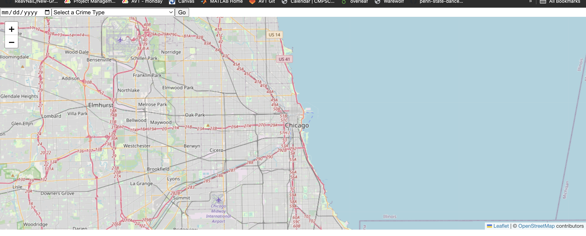
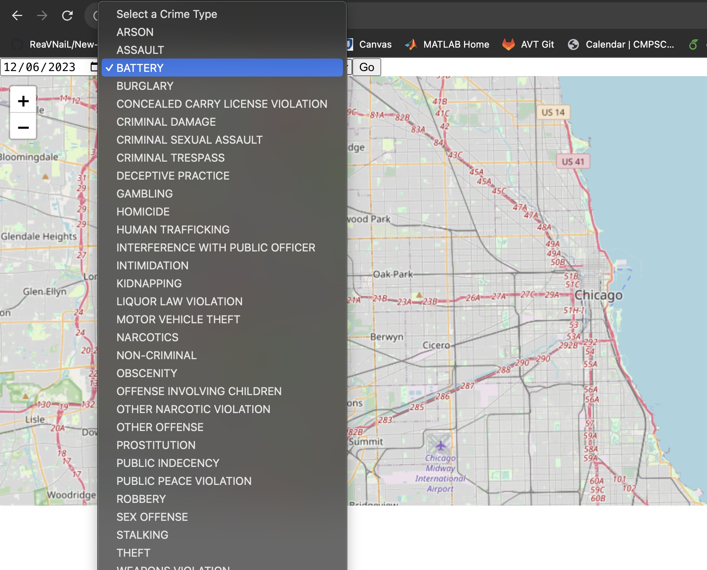
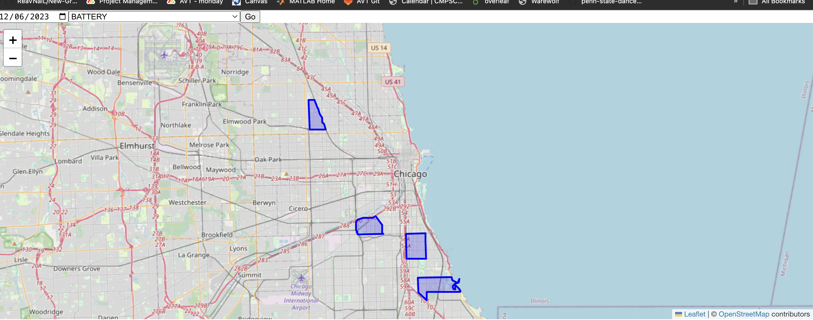
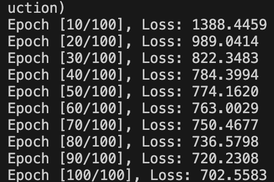

# Crime prediction using Machine learning and Artificial intelligence

This repository has all the information gathered by us while working on the project of predicting crime in the city of Chicago using machine learning algorithm and model like Neural networks and Python ACT-R. We chose Chicago as the city for testing.

## Goals, Environment, and Adaptations

### Goals

Our primary objective is to create an advanced AI system capable of recognising and mapping crime hotspots inside a city, thereby improving public safety and allowing law enforcement to allocate resources more effectively. Our AI system seeks to deliver immediate and accurate insights into high-crime regions by leveraging data analytics, machine learning, and geospatial information, helping both citizens and authorities to make informed decisions about crime prevention and intervention tactics. Our ultimate goal is to contribute to the reduction of crime and the creation of safer urban environments for everyone by assisting the police department to efficiently patrol for crime hotspots

### Environment

This system is to be used within a city’s police department and will aid in police patrol organization and dispatch in order to deter or prevent crime. This system’s stakeholders are the entity of the police department and the civilian population within a given city. Given that the predictions made by the AI model are correct, then it will have a positive impact on both stakeholders in terms of efficiency and public safety. However, if a prediction is wrong then resources of the police department will have been wasted and it may negatively impact both stakeholders.

- Strengths:
	Available data to make predictions by identifying patterns
		Weakness.
There is a possibility of the data having machine bias. Since the data may contain information about race, ethnicity, the trained AI model may have a machine bias
Primary stakeholders: Police department
- Positive effects:
Reduce patrol force
Efficiency in finding next patrol spots
- Negative effects:
Data may be invalid

### Adaptions

After the AI model predicts the location and time of a possible crime, then the police department can decide on an appropriate course of action. The initial step would be to have a testing phase so the police could verify the data being outputted and after several iterations, we will find an efficient model which has high accuracy.


## Data used?

1. Crime Data of Chicago - https://data.cityofchicago.org/Public-Safety/Crimes-2001-to-Present/ijzp-q8t2/about_data
2. Community Area data - https://data.cityofchicago.org/Facilities-Geographic-Boundaries/Boundaries-Community-Areas-current-/cauq-8yn6

## High level design of the model

We use Neural networks for prediction and use ACT-R for cognitive modelling. Neural networks are used for their advanced capabilities in pattern detection over complex data

## Usage instruction

The setup is divided in 2 parts

1. Using the web-app
2. Training the AI Model

## 1. Setting up the web-app

Installing required libraries

### Python

1. Install Python if it's not already installed on your system. You can download it from the official website: [Python Downloads](https://www.python.org/downloads/)

2. Verify the installation by running the following command in your terminal:

   ```bash
   python --version
	 ```

 3. 

To set up the project, follow these steps:

 **Clone the Repository:**
   ```sh
   git clone git@github.com:Dancy-PSU-Courses/cmpsc-497-fall-2023-final-project-ai-policing.git
   cd cmpsc-497-fall-2023-final-project-ai-policing/implementation
	 ```

4. Install required python libraries

```bash
 pip install Flask flask_cors torch pandas scikit-learn datetime
```

## Running the web-app

Make sure all the packages are downloaded

### Starting the backend web-app

Open terminal and navigate to implementation

```bash
cd implementation
```

Run the flask app backend to create the end point on localhost:4000

```bash
python app.py
```

This will start the backend server and request can be made to the Neural network trained

### Starting the frontend 

Open another terminal and navigate to frontent

```bash
cd implementation/web-app/frontend
```

Run the React app frontent to create the end point on localhost:3000

```bash
npm start
```

This will start the frontend automatically. It should look something like a map with 

<p align="center">
  
</p>

## Usage

Select the dropdown date and crime type

<p align="center">
  
</p>


and hit 'GO'

The result output will highlight the map with the relevant map areas


<p align="center">
  
</p>


## Training the model

We have seperated the training of the model from the web-app so we can train the model asynchronizally with the web-app. Run the **training.py** with the correct parameters.

```bash
python training.py
```

On the terminal you will be able to see the training MSE and loss.

<p align="center">
  
</p>

## Pre-processing the data

[The data has been already pre-processed] To preprocess the data received from the dataset we run the script.
```bash
python data_preprocessing.py
```